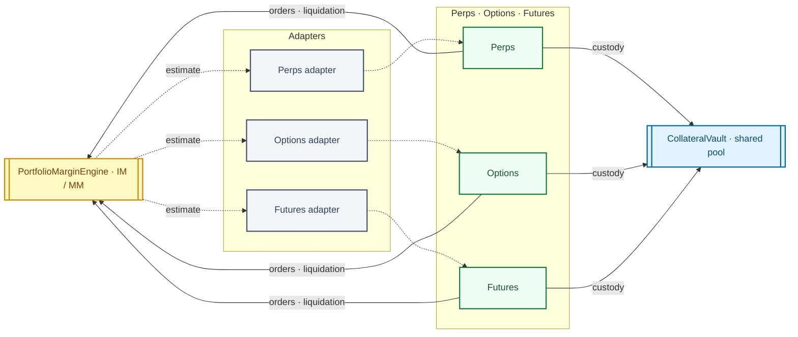

# collateral-margin

Deployable Solidity for **unified collateral custody** and **cross-product portfolio margin** (perps, options, futures, and other integrators that share the same vault and risk surface).

## Contents

| Area        | Contracts                                                                                         |
| ----------- | ------------------------------------------------------------------------------------------------- |
| Custody     | `CollateralVault` (UUPS upgradeable receipt token + authorized engine transfers)                  |
| Risk        | `PortfolioMarginEngine` (scenario-based portfolio IM/MM)                                          |
| Integration | `ICollateralVault`, `IPortfolioMarginEngine`, `IHashPowerPerpsDEX`, `IOptionsEnginePortfolioView` |
| Tests       | Mocks under `contracts/contracts/mocks/` (`USDCMock`, `PerpsDEXMock`, `OptionsEngineMock`, …)     |

## Risk estimation

This package implements a **portfolio-level** view of collateral need so one vault can back **perps and options** at the same time. That mirrors the design direction in the Titan perps repo (`contracts/docs/OPTIONS_DESIGN.md`, `FUNDING.md`, and related notes): margin should be **portfolio-aware**, not per-order in isolation, and should combine **linear perp exposure** with **options Greeks** and **funding**-related cash drains.

### Goals (from product design)

- **Cross-product netting**: A short options book partially hedged with a perp should not pay margin as if the legs were independent; risk is driven by **net delta, gamma, and vega** plus stress, not by naive per-leg adds.
- **Stress beats local Greeks**: Short gamma / short vega can look modest under small moves but fragile under jumps. The intended approach in the design docs is **scenario-based** margin: shock the underlying and volatility (conceptually similar to SPAN-style grids; the on-chain engine uses a small fixed set of scenarios to stay gas-bounded).
- **Perps-specific cash components**: Unrealized perp PnL and **pending funding** (see `FUNDING.md`) affect how much collateral must stay locked even when “model” Greeks look fine.

### What `PortfolioMarginEngine` does on-chain

`PortfolioMarginEngine` is a **pluggable calculator** wired to:

- `IHashPowerPerpsDEX` — position qty, mark/oracle price, order margin, unrealized PnL, pending funding.
- `IOptionsEnginePortfolioView` — net options delta / gamma / vega (WAD-scaled) and **reserved** options margin (engine-specific floor).

For a given `user` it computes **IM** (`computePortfolioIM`) and **MM** (`computePortfolioMM`):

1. **Aggregate Greeks** — Perp delta is treated as linear in size (`netQuantity`); option Greeks are summed in. Net delta feeds directional spot stress; net gamma and vega feed curvature and vol stress.
2. **Four stress scenarios** — Spot moves by ±`imSpotShock` or ±`mmSpotShock` (fraction of price); vol moves by ±`imVolShock` or ±`mmVolShock` (WAD absolute IV change). For each corner it approximates PnL as  
   `delta·Δs + ½·gamma·Δs² + vega·Δσ`  
   (implemented in `_worstStressLoss` / `_scenarioLoss`) and takes the **worst loss** across scenarios (only losses count; gains are clipped at zero for that scenario).
3. **Add structured extras** (same for IM/MM path except shock sizes):
   - resting **perp order margin** (`getOrderMargin`);
   - **options reserved margin** from the options engine (converted from WAD to token decimals);
   - **unrealized perp loss** (only if PnL is negative);
   - **funding owed** (only if pending funding is positive — user owes the protocol).

Defaults at `initialize` align rough intent with typical DEX buffers (e.g. 10% / 5% spot shocks for IM/MM, 10 / 5 vol points); governance can retune via `setShocks`.

`CollateralVault` can call `computePortfolioIM` when a margin engine is set, so **withdrawals** respect **portfolio IM** (you cannot free collateral that the unified model still needs).

### Diagram

Perps, Options, and Futures are **authorized** integrators on the same vault; each product calls the margin engine to enforce **IM** when **placing or matching orders**, and **MM / health** when **attempting liquidation**. For **margin estimation**, the engine walks **portfolio adapters** (per-product views such as `IHashPowerPerpsDEX`, `IOptionsEnginePortfolioView`, and a futures-facing adapter) so stress/Greeks aggregation is grounded in live positions on each contract.



**Layout:** left-to-right main spine (**engine → adapters → markets → vault**) for spacing; **dashed** links are **read / estimation** (including row-level adapter → market pairs). **Solid** from markets: **custody** into the vault and **risk checks** back to the engine.

### Scope and trust boundaries

- The engine does **not** price individual options on-chain or run a full volatility surface. It assumes **honest, consistent** Greek and reserved-margin reports from the options module (and honest perp metrics from the DEX), as sketched in the design docs (deterministic pricer + risk oracle off-chain, conservative tables on-chain).
- A richer **grid** of shocks (many spot/vol buckets, near-expiry decay shocks, concentration add-ons) remains a **model/policy** choice: parameters and/or the options adapter can be upgraded to reflect stricter risk without changing vault custody.
- **Health** for liquidations and order admission is expected to be enforced in the **product contracts** (perps, options, futures) using the same IM/MM views; this repo provides the shared arithmetic hook.

## Repo layout

- **Repository root** — npm package `collateral-margin` (used as `file:../collateral-margin` from other repos).
- **`contracts/`** — Hardhat 3 project (`collateral-margin-contracts`): sources live in **`contracts/contracts/*.sol`** (standard Hardhat `contracts` directory nested inside the package folder).

## Development

From the Hardhat package:

```bash
cd contracts
pnpm install
pnpm test
pnpm run build    # compile + export TypeScript ABIs under contracts/abi/
pnpm run clean    # remove abi, artifacts, cache
```

Requirements: Node 24.x (see `contracts/package.json`).

## Consuming from another repo

Add the dependency (path adjusted to your monorepo layout):

```json
"collateral-margin": "file:../../collateral-margin"
```

Import interfaces and sources from **`collateral-margin/contracts/contracts/...`** (first `contracts` = this repo’s Hardhat folder, second = Hardhat’s sources root), for example:

```solidity
import { ICollateralVault } from "collateral-margin/contracts/contracts/interfaces/ICollateralVault.sol";
```

If you use Hardhat, list the same paths in `npmFilesToBuild` (or your compiler’s equivalent) for any `.sol` files pulled from this package.

## License

MIT (see `contracts/package.json`; root `package.json` is a thin workspace stub).
