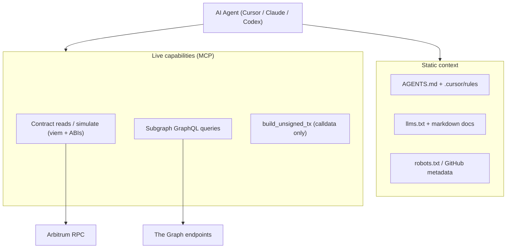

# AI Agent Discoverability Plan

Goal: make the four repos and the landing site legible and actionable to AI agents. The interaction substrate is already agent-friendly - **contracts implement standard interfaces and export ABIs**, and **subgraph/indexer GraphQL URLs are queryable**. MCP wraps exactly those two surfaces (read + simulate + build-unsigned-tx), so no new custodial infrastructure is required.

## Layered model (applied to every surface)

## 1. Shared conventions (all four repos get these)

- **Root `AGENTS.md`**: canonical agent context. Seed from existing READMEs (already contain build/test commands + architecture). Sections: project purpose, package map, per-package build/test commands, code conventions, key contract addresses + subgraph URLs, "what agents can query live" pointer to MCP.
- **Per-package `AGENTS.md`** for non-trivial packages (`contracts/`, `indexer/`, `keeper/`, `market-maker/`, `mcp/`) with the local commands + gotchas.
- **`.cursor/rules/`**: perps already has [.cursor/rules/project-conventions.mdc](perps/.cursor/rules/project-conventions.mdc). Replicate an equivalent rule in the other three repos (glob-scoped conventions), and have `AGENTS.md` reference it as the source of truth so both Cursor and non-Cursor agents converge.
- **`llms.txt`** at repo root: curated map linking the README, docs, ABIs, and subgraph schema. Optional `llms-full.txt` for single-fetch ingestion.
- **README "For AI Agents" section**: contract addresses per network, ABI path, subgraph GraphQL URL, and the MCP install snippet. This is the highest-leverage machine-usable anchor given the RPC+indexer interaction model.
- **GitHub repo metadata**: description, topics/tags (e.g. `defi`, `perps`, `arbitrum`, `the-graph`, `hashprice`, `mcp`), and a populated About panel.

## 2. Per-repo specifics

### perps ([perps/](perps))

- Strongest starting point (rich [README.md](perps/README.md), existing cursor rule, GitBook docs).
- Convert the existing rule content into a root `AGENTS.md`; keep the rule file.
- `llms.txt` linking README + `docs/gitbook/*` + `contracts/abi/abi.ts` + subgraph schema.
- MCP tools (read-first): `get_market_price`, `get_orderbook` (subgraph price levels), `get_user_position`, `get_user_collateral`, `get_funding`, `get_trades` (subgraph), plus `simulate_order` and `build_create_order_tx` / `build_deposit_tx` (return calldata, no signing).

### futures-marketplace ([futures-marketplace/](futures-marketplace))

- Weakest README (2 lines) - biggest lift. Rewrite [README.md](futures-marketplace/README.md) to match perps depth (architecture, packages, commands, tech stack).
- Add root `AGENTS.md` + `.cursor/rules`.
- `docs/` already exists (`01.Overview`..`06.Event-Design-Spec`) - add `llms.txt` mapping them.
- Note the two web surfaces: the trading `ui/` (Vite React, has [ui/public/robots.txt](futures-marketplace/ui/public/robots.txt)) is distinct from the landing site (section 5).
- MCP tools: contract specs, delivery/settlement status, orderbook + margin reads via subgraph, `build_*_tx` for order/deposit.

### collateral-margin ([collateral-margin/](collateral-margin))

- Rich [README.md](collateral-margin/README.md) already. Add root `AGENTS.md` + `.cursor/rules` + `llms.txt` (link `docs/*` design notes).
- MCP tools (read-only): `compute_portfolio_im`, `compute_portfolio_mm` (call `PortfolioMarginEngine`), `get_vault_balance` (`CollateralVault`), `get_portfolio_risk` (aggregate net delta/gamma/vega across adapters). This is the natural "risk oracle" MCP surface.

### hashprice-oracle ([hashprice-oracle/](hashprice-oracle))

- Rich [README.md](hashprice-oracle/README.md); has empty `.ai-docs/`. Add root `AGENTS.md` + `.cursor/rules` + `llms.txt` (link `docs/BLOCK_VALIDATION.md`).
- MCP tools: `get_hashprice_btc` / `get_hashprice_usd` (`latestRoundData` via `AggregatorV3Interface`), `get_oracle_status` (on-chain height vs BTC tip + staleness), `query_hashprice_history` (subgraph hourly/daily). Highest external reuse value (Chainlink-compatible feed).

## 3. MCP design (grounded in RPC + subgraph)

- **Placement**: each repo ships an `mcp/` package (TypeScript, viem, `@modelcontextprotocol/sdk`), reusing already-exported ABIs (`contracts/abi/`) and the subgraph endpoint. Independent per repo, matching the multi-repo layout.
- **Optional aggregator**: a thin `titan-mcp` that re-exports all four (best single-config UX for agents/users). Recommended once per-repo servers exist.
- **Safety model**: expose **read** and **simulate** freely; for writes, only `build_*_tx` returning unsigned calldata + a viem `simulate` result. No private keys, no signing in MCP.
- **Config surface**: `RPC_URL` per network + `SUBGRAPH_URL` env vars; contract addresses baked from a shared `addresses.json`.
- **Transport**: stdio for local dev; document a remote HTTP/SSE option later for hosted use.
- **Discoverability**: README install snippet (`.cursor/mcp.json` entry), and list servers on the official MCP Registry + directories (Smithery/Glama/PulseMCP).

## 4. Skills (optional, repeatable workflows)

- `.cursor/skills/` (or `skills/`) with `SKILL.md` files for common multi-step ops: deploy/redeploy subgraph, run e2e stack, add a new market, regenerate + copy ABIs. Descriptions written as "use this when...". Low priority vs. sections 1-3.

## 5. Landing website (separate, not in workspace - framework-agnostic)

- **`/llms.txt`** (curated) + **`/llms-full.txt`** (inlined) at site root, linking product docs, contract addresses, subgraph URLs, and MCP configs.
- **Markdown endpoints**: serve `.md` mirrors of key pages (or content negotiation) so agents fetch clean content.
- **`/robots.txt`** with explicit AI-crawler policy: allow/deny `GPTBot`, `ClaudeBot`, `PerplexityBot`, `Google-Extended`, `CCBot`, etc., plus `Sitemap:`.
- **Structured data**: schema.org JSON-LD (`Organization`, `SoftwareApplication`, `FAQPage`), OpenGraph, `sitemap.xml`.
- **"For AI agents" page + machine-readable manifest** (JSON): per-network contract addresses, ABI links, subgraph GraphQL URLs, and MCP endpoints/config - the single canonical entry point tying the whole ecosystem together.
- **`/.well-known/`** manifest if/when remote MCP is hosted.

## 6. GitHub / org-level

- `Lumerin-protocol/.github` profile repo with org-wide agent guidance and a top-level ecosystem map linking all repos + docs + MCP.
- Consistent repo descriptions, topics, and pinned repos.

## Suggested rollout order

1. `AGENTS.md` + `.cursor/rules` + README fixes (futures first) across all four repos.
2. `llms.txt` per repo + "For AI Agents" README sections with addresses/subgraph URLs.
3. MCP: hashprice-oracle first (simplest, highest reuse) -> perps -> futures -> collateral-margin; then optional aggregator + registry listing.
4. Landing site: llms.txt + robots.txt + machine-readable manifest + markdown endpoints.
5. Skills + org `.github` repo.
