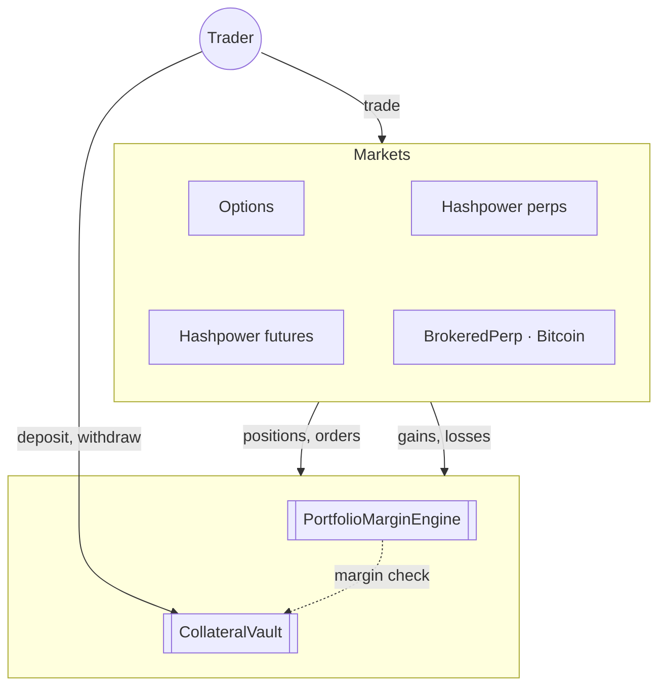
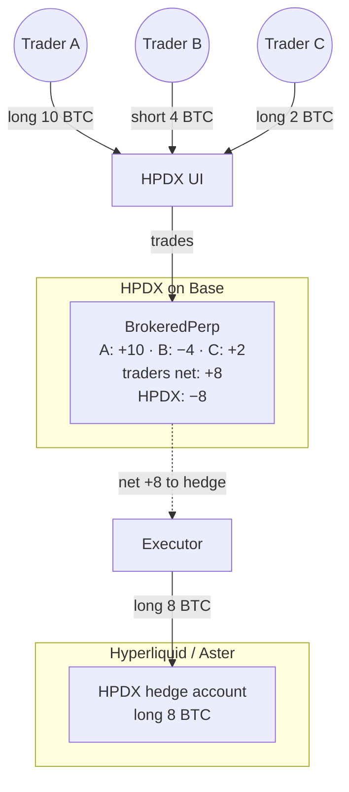
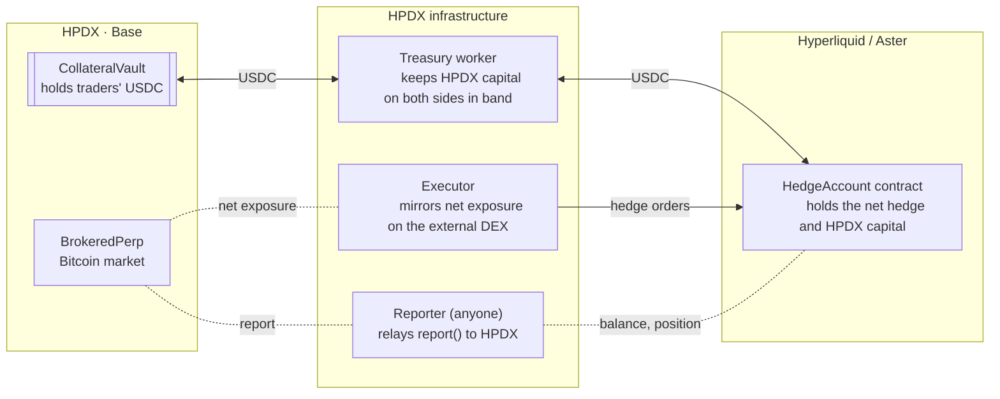

# Sharing collateral with Hyperliquid or Aster

Status: proposal, October 2026. Nothing here is built yet.

## What we want

HPDX, Titan's exchange on Base, runs a hashpower perpetual. Many of our
traders also want to hold a Bitcoin position to hedge. Today those two positions live in two separate worlds: the trader puts
up full collateral for the hashpower position on HPDX and full collateral for the Bitcoin position on Hyperliquid, even though the two largely cancel each
other out.

We want one pool of collateral that covers both.

Terms used below: **HPDX** is our exchange, one of Titan's products;
everything on our side — contracts, capital, hedge account, services —
belongs to HPDX. **The external DEX** is Hyperliquid or Aster, the venue HPDX
hedges on.

Two rules shape the design:

- **Traders never explicitly move money to satisfy margin.** A trader deposits once, trades both markets, and withdraws; they are never asked to sign transactions to move collateral at arbitrary moments when there is a need to rebalance.
- **Only HPDX's own capital moves to and from the external DEX, and only
  automatically.** An HPDX worker keeps the right amount of HPDX's money on
  each side. Traders' deposits never leave HPDX.

## Why this is hard

Three facts drive everything that follows.

1. **Third-party exchanges only margin what they can see.** Hyperliquid and
   Aster each look at the positions in an account on their own books and demand margin
   for those. They will never give credit for a hashpower position held
   somewhere else. Even Hyperliquid's own builder-deployed markets (HIP-3)
   are not cross-margined with its main markets. So any offsetting of risk
   has to happen on our side.

2. **Hashpower and Bitcoin are different assets.** Our margin engine today
   treats everything as exposure to one price. Hashpower tracks Bitcoin
   closely but not exactly — mining difficulty and transaction fees move it
   too. Offsetting the two needs a margin engine that understands they are
   correlated but not identical.

3. **HPDX cannot take money out of a trader's account on the external DEX.** The most
a trader can grant HPDX on either external DEX is permission to trade on
their behalf; only the trader can withdraw. So if a trader's hashpower
loss is covered by collateral sitting in their Hyperliquid account, HPDX has
no way to collect it.

Together these say: the only place HPDX can both verify and control
collateral on an external DEX is an account HPDX itself owns. That leads to the
design below.

## The design in one page

**HPDX becomes the counterparty for Bitcoin trades, and hedges itself on the
external DEX.**

- A Bitcoin perpetual market, `BrokeredPerp`, runs on HPDX with the same
  vault and margin engine as the hashpower market. HPDX is the counterparty
  to every trade in it.
- HPDX hedges its net Bitcoin exposure in one account on the external DEX — the
  **hedge account** (an "omnibus account"). Opposite positions from different
  traders cancel before hedging, so the external DEX margins only the net.
- A trader long hashpower and short Bitcoin pays margin only for the part
  that does not cancel — the "basis" between the two.
- The hedge account holds HPDX's capital. A worker tops it up from HPDX when
  the external DEX needs more margin and brings profits home when HPDX needs them.
  A size ceiling, set by HPDX's total capital, keeps this always possible.
- Traders deposit and withdraw on HPDX exactly as today; withdrawals are
  always immediate.

The cost is that HPDX takes a broker's role: counterparty to every Bitcoin
trade, hedging with its own capital. Traders' deposits stay on HPDX, which
keeps the custody footprint small. The appendix explains why the
non-custodial alternatives do not get there.

## The moving parts

| Part | Where | What it does |
| --- | --- | --- |
| `CollateralVault` | HPDX, exists today | Holds traders' USDC and issues a "receipt" balance per trader. |
| `PortfolioMarginEngine` | HPDX, exists today | Works out how much collateral each trader needs for all their positions together. Needs to learn about different assets |
| Hashpower market | HPDX, exists today | Unchanged. |
| `BrokeredPerp` | HPDX, new | The Bitcoin perpetual market. Looks like any other HPDX market to the vault and margin engine. Enforces the hedge capacity. |
| `BROKER_ADDR` | HPDX, new | HPDX's own account inside the vault, the counterparty to every `BrokeredPerp` position. Traders' Bitcoin losses flow into it; their gains are paid out of it. Holds HPDX's capital on Base. |
| `HedgeAccount` | HyperEVM, new | A contract whose exchange account holds the net Bitcoin hedge and HPDX's capital there. Trades via `CoreWriter`; exposes `report()`, `topUp()`, `sendHome()`. On Aster, a plain account under a key. |
| HPDX UI | HPDX servers | Shows the external DEX's Bitcoin book with HPDX's spread, cut off at capacity; quotes an all-in price and sends accepted orders to `BrokeredPerp`. |
| Executor | HPDX servers | Watches HPDX's net Bitcoin exposure and keeps the hedge account's position matching it. |
| Reporter | Anyone | Calls `HedgeAccount.report()` and relays the result to `BrokeredPerp` through the messaging layer. HPDX runs one; a bounty lets others step in. |
| Treasury worker | HPDX servers | Keeps the hedge account's balance inside its band by moving HPDX capital to and from the external DEX. |
| Treasury | HPDX | Sets how much capital HPDX commits in total and the band the worker targets. Acts rarely. |

Two views of the same system. First, what a trader touches — all of it on
HPDX:

Options talk to the engine through their own interface; the three others share
`ILinearMarket`, and `BrokeredPerp` is simply one more entry on that list.

Second, the omnibus idea. Traders use the HPDX UI; their Bitcoin trades land
in `BrokeredPerp` on HPDX, each against HPDX. HPDX sums them and mirrors
the net in its hedge account on the external DEX, so its own exposure cancels:

Trader B's short cancels part of A's and C's longs before anything reaches
the external DEX: 16 BTC of trader positions become 8 BTC of hedge, and the
external DEX margins only those 8. With separate accounts per trader it would
margin all 16.

Third, the plumbing between the two venues. HPDX and the external DEX never
talk to each other directly; three HPDX services sit in between, each
doing one job. Solid arrows are money or orders; dotted lines are information:

## How a trade works, step by step

### Depositing and withdrawing

Exactly as today. USDC goes into the vault on HPDX and comes out of it,
immediately, subject to the margin check. There is no deposit path on the
external DEX; a trader whose USDC sits elsewhere bridges it to Base first,
which the UI can embed.

### Trading Bitcoin

1. The trader takes a quote in the HPDX UI and accepts it (see [What the
   trader sees](#what-the-trader-sees)). `BrokeredPerp` checks their
   collateral against all their positions together — for a trader long
   hashpower, a short Bitcoin order mostly cancels existing risk and needs
   little extra — then records a *pending* order with the trader's price
   limit, reserves margin for it, and emits an event.
2. The executor sees the event and adjusts the hedge: nothing if another
   trader already holds the opposite side, otherwise an immediate-or-cancel
   order on the external DEX for the difference.
3. The executor sees the fill on the external DEX's fill stream and submits it
   to `BrokeredPerp`, which books the trader's position at that price plus
   spread. The contract rejects fills above the trader's limit, outside a
   band around the relayed mark, or larger than the order.
4. If no fill is submitted before the order expires — external DEX down,
   price moved — the pending order lapses and the margin is released. HPDX
   never carries more unhedged exposure than a small configured limit.

Nothing on the external DEX ever calls Base; step 3 is the executor telling
Base what happened, inside bounds the contract enforces. How that is kept
honest is the subject of [How HPDX talks to
Hyperliquid](#how-hpdx-talks-to-hyperliquid).

Funding is passed through at the external DEX's rate. HPDX earns the spread and a
small fee.

### Being liquidated

Nothing changes in how liquidation is decided: a trader is liquidatable when
their collateral falls below the maintenance level for all their positions
together. The existing keeper gains `BrokeredPerp` as a third market to reduce,
using the same step-by-step approach described in
`docs/liquidation-orchestration.md`. When a trader's Bitcoin leg is closed,
HPDX's net exposure changes and the executor adjusts the hedge.

## How HPDX talks to Hyperliquid

Base and Hyperliquid share nothing. A contract on Base cannot place an order
on Hyperliquid, and nothing on Hyperliquid can call a contract on Base. Every
"HPDX knows X" below means "someone submitted a transaction on Base saying X,
and the contract decided whether to believe it". Three things cross the gap,
each with its own mechanism and trust story.

**The hedge account is a contract.** Hyperliquid runs an EVM chain, HyperEVM,
whose contracts have accounts on the exchange itself. The hedge account is
such a contract, `HedgeAccount`: it places and cancels orders and moves USDC
between its spot and perp balances through Hyperliquid's `CoreWriter` system
contract, and reads its own position, margin and the oracle price through
read precompiles. USDC arrives from Base by Circle's CCTP, which is live on
HyperEVM and forwards into the exchange balance, and leaves the same way.
Every one of these is a contract call, so nobody holds a Hyperliquid private
key: the treasury worker is whoever pays gas to call `topUp()` or
`sendHome()`, with amounts and destinations fixed in the contract.

**Orders go HPDX → Hyperliquid through the executor, fast and bounded.** The
executor watches `BrokeredPerp` events, trades, watches Hyperliquid's fill
stream, and submits fills to Base, as in the trading steps above. This is a
trusted HPDX service — it is telling Base what it did — but the contract
bounds what it can say: the trader's limit, a band around the relayed mark,
the order size, an expiry. A fill takes two to four seconds end to end.

**State goes Hyperliquid → HPDX through `report()`, slow and verified.** Every
trader position on `BrokeredPerp` is a claim on `BROKER_ADDR`, and
`BROKER_ADDR` is solvent only if the hedge is real. The executor's fills are
HPDX's own account of that; `report()` is Hyperliquid's.

- `HedgeAccount.report()` takes no arguments and anyone can call it. It reads
  the precompiles — position, margin, oracle price — and hands the result,
  with the HyperEVM block number and the caller's address, to a cross-chain
  messaging layer (LayerZero, which has an endpoint on HyperEVM, or
  Hyperlane, which anyone can deploy) addressed to `BrokeredPerp`.
- The layer's verifiers attest that the message was really emitted on
  HyperEVM; a relayer — again anyone — delivers it to Base, where the
  endpoint calls `BrokeredPerp` after checking the sender is `HedgeAccount`.
- `BrokeredPerp` runs the three checks in [Accounting](#accounting) and
  records the time. If a check fails, or no report has arrived for ten
  minutes, the market is close-only until a passing one lands.

The caller cannot influence the contents; `report()` reads chain state and
nothing else. Authenticity comes from Hyperliquid's consensus and the
messaging layer's verifiers, not from whoever paid the gas. Silence is not
trusted either — it degrades the market — so reports being optional is safe,
and the only question is who keeps them flowing: HPDX runs a cron as the
baseline, and `BrokeredPerp` pays a small bounty from `BROKER_ADDR` to the
caller of any accepted report, so a market maker or a trader can keep the
market open if HPDX's cron dies. What remains trusted is the verifier set,
which HPDX configures: with LayerZero, two verifiers, one HPDX runs and one
independent, both required. That replaces "trust HPDX's reporter key" with
"trust that HPDX and an independent party did not collude".

**Why fills are not verified the same way.** A report round trip is thirty
seconds or more; a trader wants a fill in two. So fills stay on the fast,
bounded, trusted path, and `report()` is what makes lying on it unprofitable:
fills that were never hedged show up as a coverage mismatch within minutes.
Moving execution itself into `HedgeAccount` — `BrokeredPerp` sends the target
exposure through the messaging layer and the contract trades on receipt —
would remove the executor's trust entirely at the cost of that latency. It
is a later hardening, not v1.

**Maker orders are not offered** because Base cannot see them. The precompiles
expose position and margin, not open orders, so even `report()` cannot tell
"this order is resting" from "this order was never placed", and a resting
hedge order would tie up Hyperliquid margin and HPDX capacity indefinitely.
A limit order on `BrokeredPerp` therefore rests on Base; the executor watches
the Hyperliquid price and sends an immediate-or-cancel order when it crosses.

None of this exists on Aster: no EVM, no precompiles, API only. A report from
Aster is whoever queried the API saying so.

## Where the external DEX's liquidity goes

A big reason to connect to Hyperliquid or Aster was their deep Bitcoin books.
In this design traders trade on `BrokeredPerp` against HPDX, not on those
books. Is the liquidity benefit lost?

Mostly it is passed through. The executor hedges every fill on the external DEX
and the trader gets the hedge's price plus spread; a large order can be worked
and filled at the average, as the trader would have done themselves. What is
genuinely lost:

- **Making.** Traders are always takers, pay HPDX's spread, and earn no
  rebate.
- **Latency.** A fill takes a second or two via the executor, not
  milliseconds. The price band on `BrokeredPerp` bounds the damage, but a
  trader racing a fast market is better served on the external DEX directly.
- **Size.** The external DEX would absorb any size its book can; `BrokeredPerp`
  stops at a ceiling set by HPDX's capital.
- **External DEX features.** Only what the executor and `BrokeredPerp` expose.

Two things follow. The ceiling is the real limit, and it can be raised later
by letting outside capital — market makers or a pooled vault — fund
`BROKER_ADDR` for a share of the spread; the contracts should not rule that
out. And the original UI-adapter path — trading on Hyperliquid in the trader's
own account, with HPDX earning a builder fee — should stay available next to
`BrokeredPerp`: full liquidity without netting for pure Bitcoin speculators,
netting with bounded liquidity for hedgers.

### What the trader sees

`BrokeredPerp` has no liquidity of its own, so the UI shows the external DEX's
Bitcoin book — the only thing a trader can actually hit — and works like a
swap, not an order book:

- **Depth** is the external DEX's live ladder, cut off at remaining capacity.
  Show it raw and quote an all-in price (book plus spread) for the trader's
  size; that is simpler and harder to misread than shifting every level.
- **Mark price** is the external DEX's mark, as for margin and funding.
- **Orders are quote-and-accept.** Enter a size, see the expected fill, accept
  with a slippage tolerance. The executor hedges and records the fill at the
  hedged price if within tolerance, otherwise rejects.
- **Limit orders are triggers**: "fill me when the external DEX price crosses this
  level". The executor then takes on the external DEX. No maker rebate; shown in
  the trader's own order panel, not in the ladder.
- **Netted fills are priced the same.** When two traders offset, no hedge is
  sent, but both are filled off the external DEX book plus spread. Netting saves
  HPDX slippage and margin; it does not change the trader's price, or prices
  would depend on who else happened to be trading.

A resting book on HPDX is deliberately absent: it would fragment liquidity,
make HPDX look like it has depth it does not, and two HPDX orders crossing
would still have to be priced from the external DEX.

## Keeping the hedge account funded

The hedge account needs margin on the external DEX; `BROKER_ADDR` needs cash on
HPDX to pay traders' gains. The two move in opposite directions — when the
hedge gains, traders have lost and `BROKER_ADDR` fills; when it loses,
`BROKER_ADDR` drains and the external DEX wants more margin — so a treasury worker
keeps both inside bands by moving HPDX's capital across the bridge.

- **Target and band.** The hedge account's target is the external DEX's margin
  requirement plus a buffer covering an adverse move over one bridge crossing
  — minutes, so a few percent, not a full crash. Below the band the worker
  tops up from `BROKER_ADDR`, never from traders' USDC; above it, it brings
  the excess home.
- **A hard ceiling.** `BrokeredPerp` refuses any order that would push
  traders' net position past a capacity set by HPDX's *total* committed
  capital on both sides. Orders that reduce risk always pass. The check runs
  on HPDX, instantly, and is what keeps the worker from ever being asked to
  do the impossible.
- **If something fails** — `BROKER_ADDR` empty, bridge down, a move faster
  than a top-up — the market goes **close-only**: positions can shrink but not
  grow, and the hedge shrinks with them. HPDX's capital on the external DEX is what
  is at risk in that window; traders' money is not. A cap on how much HPDX
  capital may sit on the external DEX bounds the damage.

On Hyperliquid the worker is just a caller of `HedgeAccount.topUp()` and
`sendHome()`, which only move money between the hedge account and the HPDX
vault, within rate limits: it can nudge, not steal. On Aster the worker holds
a live key to HPDX's master account.

## Accounting

Traders' receipts are backed by USDC the vault holds on HPDX, as today:

$$
\text{USDC in the vault} \;\ge\; \text{total receipts} - \text{insurance debt}
$$

HPDX's capital is tracked separately, in `BROKER_ADDR`, the hedge account, and
whatever is in transit between them. Only real USDC moves between the pots;
nothing is credited on the strength of a report. Reports are used for three
checks, and a failed check means close-only until it passes again:

- **Coverage** — the hedge position matches traders' net position on
  `BrokeredPerp`.
- **Explained change** — the hedge balance moved only by worker transfers
  and profit-or-loss at the relayed price. A persistent unexplained
  drop halts the vault through the existing mechanism.
- **Funding** — the hedge balance still covers margin plus buffer.

## Offsetting hashpower against Bitcoin

Hashprice — what a unit of mining power earns per day in dollars — is roughly
Bitcoin's price times the block reward, divided by mining difficulty:

$$
\text{hashprice} \approx \frac{\text{BTC price} \times \text{block reward}}{\text{difficulty}}
$$

Over the hours a margin shock cares about, the Bitcoin price term does most of
the moving. Difficulty changes in steps every two weeks, often by several
percent, and fees add noise. So a long hashpower position behaves like a long
Bitcoin position plus a leftover piece — the **basis** — that no Bitcoin
position can hedge.

The change to the engine:

- Each market says which price it is exposed to. The hashpower market reports
  exposure to hashprice; `BrokeredPerp` reports exposure to Bitcoin. Nothing
  else about the existing markets changes.
- The engine keeps one price feed per asset and knows how hashprice relates to
  Bitcoin: a sensitivity factor (somewhere around 0.6–0.8 to start, tuned from
  history) plus an independent basis piece.
- Stress scenarios move Bitcoin up or down with hashprice moving along by the
  sensitivity factor, combined with the basis moving up or down on its own.
  The collateral requirement is the worst case. Bitcoin and hashpower cancel
  through the shared Bitcoin move; the basis never cancels.
- Resting orders are handled the way they already are, just per asset.

Because `BrokeredPerp` settles into the same vault as the hashpower market,
the engine's existing rules about when gains may offset losses apply as they
are. The engine never needs to know the Bitcoin book is hedged elsewhere.

For example, a trader long hashpower worth 10 BTC and short 10 BTC on
`BrokeredPerp` pays collateral only for the basis on 10 BTC-worth of hashpower,
plus a little for the sensitivity factor being below one — instead of full
margin on both legs.

## Proving the hedge is real

Traders are trusting that the hedge account really holds the position and
margin HPDX says it does. Whether anyone other than HPDX can check this
depends on the external DEX.

**Hyperliquid.** Yes, via `report()` as described above: what HPDX receives
is backed by Hyperliquid's consensus and the messaging layer's verifiers, not
HPDX's word — as close to a public proof of reserves as a centralised hedge
can get.

**Aster.** No equivalent. Account data comes only from Aster's own API,
unsigned, from a closed-source chain with nine hand-picked validators, and
privacy mode hides it entirely unless the account is set to public. Aster's
zero-knowledge proofs cover hidden *orders*, not what an account holds. A
report from Aster is therefore only a statement by whoever queried the API.
Requiring several reporters to agree, or running the reporter in secure
hardware, makes lying harder but still verifies nothing. If Aster is used:
public mode, multiple signers, and tighter caps.

## Hyperliquid versus Aster

| | Hyperliquid | Aster |
| --- | --- | --- |
| Can HPDX verify the hedge account? | Yes, via HyperEVM reads backed by consensus | No; reports are trusted statements |
| Treasury worker's transfers | Via a HyperEVM contract; no live master key | Live master key required |
| External DEX withdrawal time | 3–5 minutes, 1 USDC fee | Batched; slower |
| Getting HPDX capital there from Base | Circle's CCTP, or via Arbitrum | Via Arbitrum, BNB Chain or Ethereum; no Base support |
| Is HPDX's hedging visible to others? | Yes | No, if privacy is on — but then nobody can audit it either |
| External DEX's own margin engine | Mature; cross-margin, auto-deleveraging | Multi-asset mode |
| Recommendation | First venue | Possible second venue with tighter limits |

## What HPDX is taking on

- **Price slippage.** Traders are filled at the external DEX price plus spread;
  the hedge fills a moment later. The spread and the unhedged-exposure limit
  bound this. HPDX's capital absorbs what is left.
- **Losing capital on the external DEX.** A bridge outage during a crash
  could get the hedge account liquidated before a top-up lands; the external
  DEX itself could fail. Either way the loss is capped at the HPDX capital
  sitting there, traders' deposits are unaffected, and traders' HPDX positions
  would have to be re-hedged or closed.
- **Reports being wrong.** On Hyperliquid this needs the messaging layer's
  verifiers to collude; on Aster it needs one reporter to lie. Either way a
  bad report can only stop new risk, not recover funds.
- **Regulation.** HPDX holds funds on behalf of traders and is the other side
  of their Bitcoin trades. That is a broker's role, and the obligations land
  on Titan as the operator. The legal view is outside this document; it is
  the cost of real collateral sharing.

## Plan

1. **Teach the margin engine about multiple assets.** Per-market asset tags,
   one price feed per asset, correlated stress scenarios with an un-netted
   basis. Useful on its own; tested against the existing markets only.
2. **Launch `BrokeredPerp` on Hyperliquid.** Treasury funds `BROKER_ADDR` and
   the hedge account; the treasury worker keeps them in band through the
   HyperEVM contract; `BrokeredPerp` enforces capacity; executor and reporter
   run.
3. **Consider Aster as a second venue.** Multi-signer reporter, lower caps,
   and a decision on public versus private mode.

## Open questions

- LayerZero or Hyperlane for HyperEVM → Base, which verifiers to require,
  the report cadence and staleness limit, and the bounty size.
- Calibration of the hashprice–Bitcoin sensitivity and the basis stress from
  historical data.
- Whether `BrokeredPerp` needs any resting orders on HPDX at all, given the
  liquidity argument for quote-and-accept; and whether to ship the direct
  Hyperliquid path alongside it from day one.
- The treasury worker's band and buffer, given bridge latency under stress.
- On Aster: whether a limited trading key can sign withdrawals — a testnet
  experiment that decides whether HPDX's master key has to stay online.
- Whether to add deposits directly on the external DEX later, via per-trader
  sub-accounts swept into the hedge account. Left out of v1 because it means
  tracking money in transit and queueing withdrawals against it; a bridge
  widget covers most of the need.

## Appendix: designs considered and dropped

### Lending HPDX funds into traders' own external-DEX accounts

HPDX gets a trading key on each trader's own external-DEX account, reads their
external-DEX position into the margin engine, and lends vault funds to that
account to cover its margin. Fails on fact 3: HPDX can never get the money
back (Hyperliquid trading keys cannot withdraw; Aster withdrawals pay only the
owner's wallet), and the external DEX still charges the trader full margin with no
netting.

### Letting traders move their own freed collateral to the external DEX

HPDX reads the trader's Hyperliquid hedge via HyperEVM, offsets it against
hashpower, and lets the trader withdraw the freed collateral to their own
Hyperliquid account as margin there. Saves real collateral, but every price
move then requires the trader to bridge money one way or the other within
minutes or be liquidated — no HPDX worker can act in their account. Netting
was also one-directional and never across traders.
