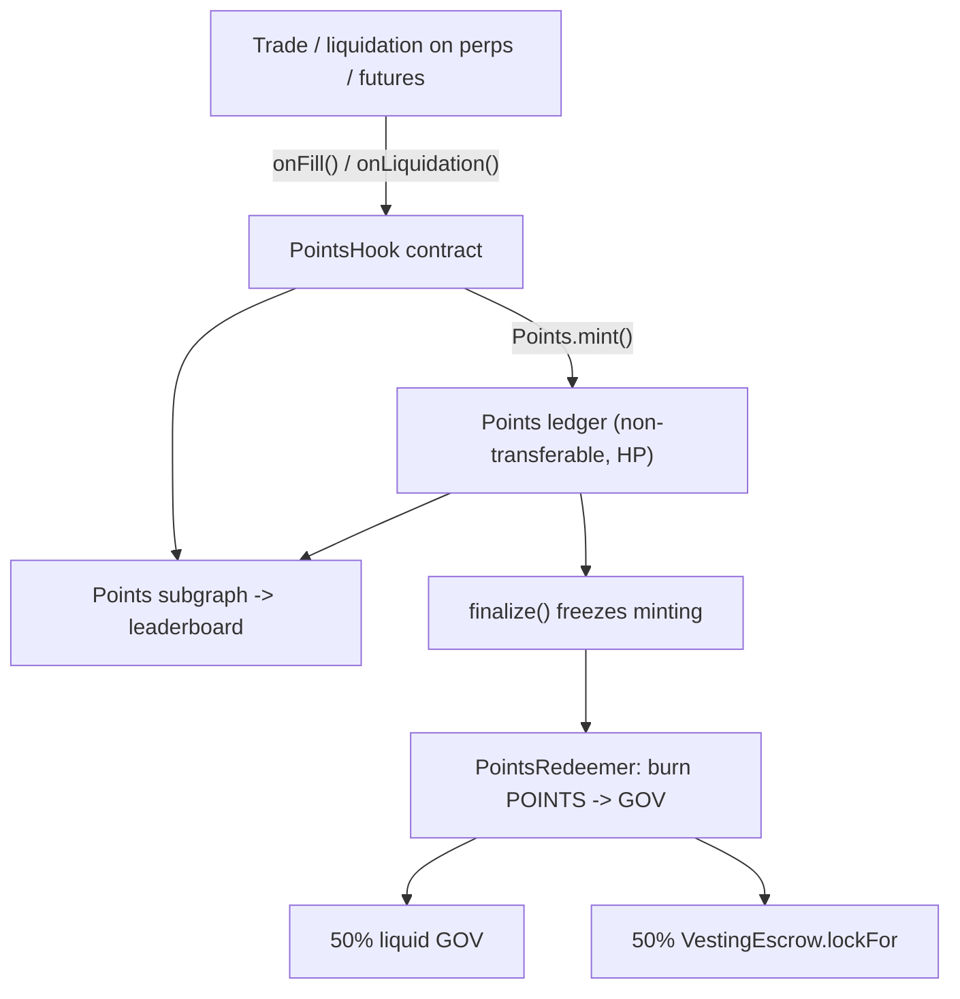

# Points System Design Specification

## Status

Implemented. This document describes a points/rewards program for the perps and futures-marketplace venues, the on-chain contracts that power it, and the path from points to the GOV governance token. The contracts (`Points`, `PointsHook`, `PointsRedeemer`) and the points subgraph live in `collateral-margin`; the venue-side wiring lives in the `perps` and `futures-marketplace` repos.

Several features sketched in early drafts were deliberately **deferred** to keep the first iteration minimal and hard to game: referral rewards, a loyalty/streak multiplier, and per-account caps. Their designs and the rationale for cutting them are recorded in [`points-system-improvements.md`](./points-system-improvements.md). This document describes what was actually built.

## 1. Goals and context

The goal is to bootstrap activity on two new on-chain CLOB venues by rewarding users with **points** that will later be convertible into the **GOV** governance token. Points are designed to:

- Reward the activity that actually creates protocol value (matched, fee-generating volume), weighted to bootstrap liquidity.
- Live on-chain as a token, so the eventual conversion to GOV is a simple token operation rather than an off-chain reconciliation.
- Be non-transferable between users, so they cannot be sold on secondary points markets while the program runs.

Reference points programs (Tensor, Blur, Blast, EigenLayer) and the broader analysis are summarized in Galaxy's [Crypto Points Programs](https://www.galaxy.com/insights/research/crypto-points-programs) report; the design choices below are informed by it, but deliberately diverge on one major axis: **points are accounted on-chain, not off-chain.** The rationale for that divergence is recorded in [Section 8](#8-accepted-tradeoffs).

### What is being traded (for context)

- **perps** (`HashPowerPerpsDEX`): an on-chain CLOB for perpetuals with maker/taker fees, funding, and permissionless liquidation. Positions form when two users' orders match.
- **futures-marketplace** (`Futures`): an on-chain CLOB for Bitcoin **hashprice** futures (forward contracts on mining revenue), with maker/taker fees and permissionless liquidation. Each matched unit is a "lot".

Both venues share a single `CollateralVault` for collateral.

## 2. What to incentivize

Liquidity is the bottleneck for a new CLOB, and protocol value accrues from fee-generating volume. Priorities, in order:

1. **Core engine — matched volume**, with a maker multiplier higher than taker early on to bootstrap liquidity (the approach Blur used at launch), gated by a minimum fee paid per side.
2. **Keeper bucket** — a small reward for executing liquidations, which keeps the books solvent.

Referral and loyalty multipliers were considered but **deferred** (see [`points-system-improvements.md`](./points-system-improvements.md)); referral in particular is irreducibly sybil-gameable on-chain and would subsidize wash trading.

Explicitly **not** rewarded:

- Raw `OrderCreated` count — placing and cancelling orders is nearly free and trivially farmed.
- Deposit events — deposit/withdraw loops are free to farm; collateral that merely sits idle is low value.
- Physical delivery completion (futures) — removed for simplicity in this iteration.

### Maker vs taker

Both venues distinguish maker and taker on-chain:

- perps: the `OrderMatched` event carries `maker`, `taker`, and separate `makerFee` / `takerFee`.
- futures (3.0): `OrderMatched` carries `maker`, `taker`, `makerFee` / `takerFee` (same shape as perps, plus `deliveryAt`).

This lets the points hook (Section 5) apply different weights to each side without any off-chain inference.

## 3. Concrete points formula (single window)

Per unit of activity (weights are WAD-scaled; `WEIGHT_SCALE = 1e18`, so `weight = 1e18` ⇒ 1 POINT per notional unit):

- **Taker points** = `notional * w_taker / WEIGHT_SCALE` (e.g. base 1 point per $ of notional).
- **Maker points** = `notional * w_maker / WEIGHT_SCALE`, with `w_maker > w_taker` at launch (e.g. `w_maker = 1.5 * w_taker`) to bias toward liquidity provision.
- **Minimum fee threshold** (instead of fee weighting): a side earns only if its fee paid is `>= minFee`. A maker rebate (non-positive `makerFee`) earns nothing. Fees are the most wash-resistant signal because they cost real money into the insurance fund; gating on a minimum fee ties points to genuine economic cost while keeping the hot path a single multiply. (Continuous fee-weighting was considered and dropped for simplicity — see [`points-system-improvements.md`](./points-system-improvements.md).)
- **Keeper points** = a flat number of points per liquidation executed.

All weights are parameters of the `PointsHook` contract (Section 5), not the venue contracts, so they can be retuned without touching the trading hot path.

## 4. Time model: single program window (no epochs)

The program is **one continuous window** from genesis to program end. There are no recurring sub-epochs and no rollover logic.

- Points accrue continuously (`absolute accrual = activity * weight`) over the single window.
- Conversion math at program end: `userGOV = pool * userPoints / totalPoints` — a fixed treasury GOV pool split pro-rata. This pro-rata split at the end is the only "budget" boundary.
- There is a single cumulative balance per user (the `POINTS` balance); no per-epoch entities. (Per-account caps were considered and deferred — see [`points-system-improvements.md`](./points-system-improvements.md).)

## 5. Contracts

All incentive contracts are **non-upgradeable, plain deploys**. Mutability that the program genuinely needs (formula retuning, disabling) is achieved by replacing the `PointsHook`, not by proxy upgrades.

### 5.1 `Points` token (`HP`)

- Name "Hashrate Points", symbol **`HP`**, **6 decimals** (matching GOV), **non-upgradeable**.
- **Not an ERC20 you can move — a non-transferable ledger.** It exposes the *read* side of the ERC20 interface (`name` / `symbol` / `decimals` / `balanceOf` / `totalSupply`) over a plain `mapping(address => uint256)` balances store and emits standard `Transfer` events on mint/burn, so wallets and the subgraph can track balances. But:
  - there are **no allowances**; `approve` is disabled and `allowance` always returns 0,
  - `transfer` / `transferFrom` **always revert** (`TransfersDisabled`),
  - the only state changes are `mint` (attribution) and `burn` (redemption).
- **Roles** (OpenZeppelin `AccessControl`):
  - `MINTER_ROLE` — granted to `PointsHook`; the only caller that can `mint`.
  - `BURNER_ROLE` — granted to `PointsRedeemer`; the only caller that can `burn(from, amount)`.
  - `DEFAULT_ADMIN_ROLE` — the Safe/owner; grants the above roles and calls `finalize()`.
- **Why a pure ledger rather than a restricted-transfer ERC20**: because POINTS are never transferred between accounts, there is nothing to gate — redemption is just a burn. The redeemer holds `BURNER_ROLE` and burns the user's balance directly in `swap()`, so there is **no `approve()` and no `transferFrom`** anywhere. Blocking all transfers also fully removes the secondary-market profile the Galaxy report flags (Section 11).
- **Lifecycle**: minting is open for the duration of the program. `finalize()` (admin) permanently freezes minting (fixing `totalSupply`) and thereby gates redemption. After `finalize()` no new points can be minted (`notFinalized` modifier on `mint`).

Transfer gate (the entry functions, not `_update`):

```solidity
function transfer(address, uint256) external pure returns (bool) { revert TransfersDisabled(); }
function transferFrom(address, address, uint256) external pure returns (bool) { revert TransfersDisabled(); }
function approve(address, uint256) external pure returns (bool) { revert TransfersDisabled(); }

function mint(address to, uint256 amount) external onlyRole(MINTER_ROLE) notFinalized { /* ... */ }
function burn(address from, uint256 amount) external onlyRole(BURNER_ROLE) { /* ... */ }
```

### 5.2 `PointsHook`

- **Non-upgradeable, plain deploy.** Holds `MINTER_ROLE` on `POINTS`. Contains all the points math and weight parameters. Not a fund-holding contract.
- Implements `IPointsHook` with two entry points called by the venues:
  - `onFill(maker, taker, notional, makerFee, takerFee, makerPrice, refPrice)` — called by perps `_executeMatch` and futures lot creation. Skips entirely on a self-match (`maker == taker`); otherwise mints `notional * w_taker / WEIGHT_SCALE` to the taker when `takerFee >= minFee`, and `notional * w_maker * mult / WEIGHT_SCALE^2` to the maker when `makerFee > 0 && makerFee >= minFee` (a maker rebate earns nothing). `mult` is the **maker price-improvement multiplier** (see [Section 5.2.1](#521-maker-price-improvement-multiplier)). Each side mints via `points.mint`, which emits the POINTS `Transfer(0x0 -> account)` the leaderboard subgraph indexes; the hook emits no separate accrual event. Note: one perps `createOrder` can walk the book and match against N resting maker orders in a single transaction, producing N `onFill` calls — so minting is O(matched levels) per taker transaction.
  - `onLiquidation(liquidator, fee)` — called by perps `liquidatePosition` and futures `liquidatePosition` / `liquidateOrder`. Mints flat keeper points to the liquidator.
- **Caller authorization**: the hook checks that the caller holds a `HOOK_CALLER_ROLE`, granted only to the two venue contracts, so arbitrary addresses cannot mint points by calling the hook directly.
- **Retuning**: changing `w_maker`, `w_taker`, or the keeper rate is done by deploying a new `PointsHook` and calling `setHook()` on each venue. No proxy is required because the hook is designed to be **replaced**, not upgraded.

```solidity
interface IPointsHook {
    function onFill(
        address maker,
        address taker,
        uint256 notional,
        int256 makerFee,
        uint256 takerFee,
        uint256 makerPrice, // resting maker order price (venue price units)
        uint256 refPrice    // oracle reference, same units; 0 ⇒ no bonus (stale oracle)
    ) external;

    function onLiquidation(address liquidator, uint256 fee) external;
}
```

#### 5.2.1 Maker price-improvement multiplier

To reward *tight* liquidity (not just filled volume), the maker side of `onFill` is scaled by a multiplier based on how close the resting maker quote was to a manipulation-resistant reference price:

- `spread = |makerPrice - refPrice| / refPrice`. The multiplier is `maxMakerMult` (WAD; e.g. `3e18` == 3x) at `spread == 0`, tapers **linearly** to 1x at `spread == maxSpread`, and is 1x beyond. Both `maxMakerMult` and `maxSpread` are admin-tunable hook parameters; the bonus is **disabled by default** (`maxMakerMult == 0`), so the hook behaves as a plain linear model until `setPriceImprovement` turns it on.
- The reference is an **oracle**, never the order-book mid (which a maker can push toward their own order). Each venue sources it from its existing oracle: perps from the price oracle (`getMarketPrice`'s feed), futures from the hashrate oracle. The taker side is **not** multiplied.
- **Oracle degradation contract.** The venue passes `refPrice = 0` when its oracle is stale/invalid (via a non-reverting read, *not* the reverting `getMarketPrice()`), and the hook then applies a neutral 1x. This keeps the rule: the incentive layer **fails soft** (base maker points still mint, bonus drops) and can never block a fill the matching engine would otherwise allow — whereas the engine's own margin/funding/liquidation paths **fail closed** on a stale oracle, as before. Base maker/taker/keeper accrual never depends on the oracle.
- Why "near", not "far": rewarding quotes *close* to fair value tightens spreads (useful liquidity); rewarding distance would pay for liquidity that rarely fills. The multiplier is still minted only on a fee-paying fill, so it inherits the same wash-resistance as the base maker points.

### 5.3 Venue wiring (perps, futures)

Venue changes are deliberately minimal and live in the venue repos, not here:

- Each venue stores an `IPointsHook hook` address (appended at the end of storage for upgrade
  safety) with a `setHook(address)` owner setter that emits `HookUpdated`.
- Each venue adds call sites that invoke the hook directly, skipping when it is unset:

```solidity
if (address(hook) != address(0)) {
    // `makerPrice` is the resting maker order's price; `_refPriceForPoints()` reads the
    // venue oracle but returns 0 (rather than reverting) when stale, so points never block a fill.
    hook.onFill(maker, taker, notional, makerFee, takerFee, makerPrice, _refPriceForPoints());
}
```

- **No `try/catch` isolation.** An earlier draft wrapped the call so a points-side revert could
  never block trading, but the call is intentionally *not* isolated. Rationale:
  - The hook is a small, owner-controlled, non-upgradeable contract; if it ever misbehaves it is
    unplugged instantly with `setHook(address(0))` — no upgrade, no migration.
  - `try/catch` interacts badly with `eth_estimateGas`: because the catch swallows an
    out-of-gas inner call, estimation settles on the gas level where the hook no-ops, so points
    would silently fail to mint unless callers always added a gas buffer.
  - Failing loudly surfaces misconfiguration (e.g. the venue missing `HOOK_CALLER_ROLE`, or the
    POINTS token already `finalize()`d) instead of silently dropping points.
- **Operational consequence**: because a reverting hook *does* block fills and liquidations, the
  hook MUST be unplugged (`setHook(address(0))` on every venue) BEFORE `Points.finalize()` — after
  finalize, `mint` reverts and would otherwise brick trading. The venue (proxy) must also hold
  `HOOK_CALLER_ROLE` on the hook before it is plugged in.
- Setting `hook = address(0)` disables points entirely, with no contract upgrade.
- The only thing the venue repos import from collateral-margin is the `IPointsHook` interface.
  Each venue depends on collateral-margin via `package.json` and adds `Points.sol` / `PointsHook.sol`
  to its Hardhat `npmFilesToBuild` so the real contracts (not mocks) are used in integration tests.

### 5.4 In-protocol anti-gaming

- **Self-match exclusion** in the hook (and reinforceable at the venue): `onFill` returns early when `maker == taker`. Perps already exposes `Fill.counterparty`, and futures exposes `Lot.seller` / `Lot.buyer` plus `makerOrderId` / `takerOrderId`, so a venue can also skip the call.
- **Minimum fee threshold** (`minFee`) per side, so dust trades cannot be spammed for points and maker rebates earn nothing.
- **Positive-fees invariant** at the venue config (Section 8).

Per-account caps were considered as a further defense but deferred (see [`points-system-improvements.md`](./points-system-improvements.md)).

## 6. POINTS -> GOV conversion

- GOV is a fixed 50M supply, mint-once token (no live distributor today), so the swap is funded from a **treasury-funded GOV pool**, not new minting.
- Conversion is enabled only **after `finalize()`** (minting frozen, so `totalPoints` is fixed).
- `PointsRedeemer` holds `BURNER_ROLE` on `POINTS`. A user calls `swap()`; the redeemer reads the caller's balance and **burns it directly** via `burn(user, balance)` — there is no `transferFrom` and **no `approve()`**, because POINTS cannot move.
- Payout is pro-rata against a snapshot taken when redemption is enabled: `userGOV = govPool * userPoints / totalPointsSnapshot`. `previewSwap(user)` quotes the payout off-chain.
- The GOV payout is split **50/50** between liquid GOV and `VestingEscrow.lockFor` (the existing governance-token escrow: 180-day cliff + 90-day linear vest, with the 1.5x relock bonus available), reusing the `TokenMigration` pattern already in the governance-token repo.
- Because POINTS is already an on-chain balance the redeemer can burn directly, **no Merkle distributor is needed**.
- The swap and the pool size are **discretionary** (the pool can be zero). Per the legal analysis in the Galaxy report, conversion is the step that creates the most regulatory exposure, so it is kept discretionary and not promised.

### Future GOV migration

If a later program replaces POINTS with real GOV, a migration contract similar to the existing `TokenMigration.migrate()` pattern is granted `BURNER_ROLE` and burns the user's POINTS within the same **user-initiated** `migrate()` transaction while distributing the new token. No prior `approve()` is needed (POINTS has no allowances), so the UX is a single transaction. Migration is user-initiated, not a protocol batch sweep.

## 7. Indexer: leaderboard + mirror

The `Points` balance is the **canonical** ledger. The indexer is not the source of truth; it serves two purposes:

1. **Live leaderboard** — the primary user-facing surface. A `UserPoints` entity, queryable by any frontend with `orderBy: total`.
2. **Mirror** — keeps the leaderboard in sync with on-chain events, so it always reflects canonical balances. Every mint is also counted (`mintCount`) and recorded as a `PointsMint`.

Design — the subgraph indexes **the points contracts only**, not the venue contracts:

- **Two data sources**, both in collateral-margin and deployable on a single chain:
  - `Points` — `Transfer` (mint/burn → `total`, `totalSupply`, `mintCount`, `PointsMint`) and `Finalized` (program lifecycle).
  - `PointsRedeemer` — `RedemptionEnabled` and `Swapped` (burn + GOV payout split), feeding `PointsRedemption` entities.
- **Why no hook data source**: every accrual ends in `points.mint(...)`, which emits a POINTS `Transfer(0x0 -> account)`. The subgraph mirrors that one stream — counting each mint and recording a `PointsMint` row — so the hook needs no dedicated accrual events and is not indexed. This avoids re-implementing maker/taker math in AssemblyScript and avoids drifting from the contract when weights change, since the subgraph never re-derives the formula. It also removes the cross-network problem — there is one POINTS token regardless of how many venues mint through it. The cost is that the maker/taker/keeper category split is no longer surfaced on-chain; it was dropped as non-essential analytics (see [`points-system-improvements.md`](./points-system-improvements.md) if it is ever needed).
- **Dedicated subgraph**, not an extension of the production accounting subgraph. The points formula is volatile (it changes when the hook is redeployed); keeping it separate lets it re-sync independently of the accounting subgraph that keepers and the market maker depend on.
- **Mirror exactness**: `total` / `totalSupply` and `mintCount` are reconciled directly from `Points.Transfer` — asserted in the subgraph tests.
- Entities: `PointsProgram` (totals, `mintCount`, finalized flag), `UserPoints` (`total`, `totalEarned`, `mintCount`), `PointsMint`, `PointsRedemption`.

## 8. Accepted tradeoffs

This design chose **on-chain hook-based minting** over off-chain accounting. The off-chain alternative (a service that reads the subgraphs and stores points in a database) was considered and rejected. The reasoning is recorded here so it is not relitigated:

- **Gas**: negligible on Base (an SSTORE + a mint event per fill). Not a real cost.
- **Formula transparency**: a non-issue. Anyone can reverse-engineer the formula from a single trade, so there is nothing to hide; the formula is intentionally public.
- **Formula mutability**: solved by the hook approach. Retuning weights is a new `PointsHook` deploy + `setHook()`, not a UUPS upgrade of the fund-holding perps/futures contracts and not a re-audit of the trading hot path.
- **Wash trading**: trade fees make wash trading costly, and the unknown pre-TGE GOV price removes the certain-arbitrage motive that drove the LooksRare wash explosion (where LOOKS was already liquid and priced, making wash a calculable risk-free arbitrage). On this basis, **sybil / cluster detection is out of scope** for this iteration. The defenses retained — the positive-fees invariant, self-match exclusion, and a minimum fee threshold — are sufficient for a bootstrap program. Referral, loyalty, and per-account caps were deliberately deferred rather than shipped half-built (see [`points-system-improvements.md`](./points-system-improvements.md)); referral in particular is irreducibly sybil-gameable and was the clearest cut.

### Positive-fees invariant (hard dependency)

The net trade fee (`makerFee + takerFee`) must stay **strictly positive** while points are live — in particular, no negative `makerFeeBps` (maker rebate) on perps. A maker rebate would turn wash trading into a net-profit subsidy (rebate + points > cost), breaking the primary economic deterrent. This must be enforced as a deploy-time / configuration invariant for as long as the program runs.

## 9. Repo placement

Everything incentives-related lives in **collateral-margin**, the shared infrastructure repo used by both venues, making it the natural home for cross-venue components:

- **Design document**: `collateral-margin/docs/points-system-design.md` (this file); deferred features in `collateral-margin/docs/points-system-improvements.md`.
- **Contracts** (`Points`, `PointsHook`, `PointsRedeemer`, plus `GovTokenMock` / `VestingEscrowMock` for tests): `collateral-margin/contracts/contracts/`, with tests in `collateral-margin/contracts/tests/` and a `deploy-points.ts` script (`pnpm deploy:points`).
- **Points subgraph** (leaderboard + mirror): `collateral-margin/points-indexer/`, separate from the existing accounting subgraph.
- **Venue wiring** (the `hook` address + `setHook` setter + the `onFill` / `onLiquidation` call sites + `HOOK_CALLER_ROLE` grant): in the venue repos `perps/` and `futures-marketplace/`. They import only the `IPointsHook` interface from collateral-margin.
- **GOV / `VestingEscrow`**: unchanged, in the `governance-token` repo. `PointsRedeemer` calls into the existing `VestingEscrow.lockFor`.

### Upstream coupling mitigations

Because the points subgraph indexes the **points contracts only** (`Points`, `PointsRedeemer`) and not the UUPS-upgradeable venue contracts, it does not depend on venue event signatures — a venue upgrade cannot silently break the leaderboard. The only coupling is the `IPointsHook` interface the venues import; that surface is small and pinned. Remaining hygiene:

- Vendor pinned ABI files for the three points contracts into `points-indexer/abis/` (reusing the org's existing `contracts/abi` -> `keeper/src/abi.ts` copy convention).
- Track an explicit start block per data source.

## 10. Data + value flow



## 11. Legal / ops notes

- Clear terms & conditions; likely geo-fence US IP addresses at the frontend (as Marginfi did); no guaranteed-conversion language (the pool is discretionary).
- **All transfers are blocked** (`transfer` / `transferFrom` / `approve` revert; no allowances), so POINTS cannot be sold on secondary points markets (Whales Market / Pendle) — this removes a wash-trade exit and lowers the "tradeable quasi-asset" profile the Galaxy report flags. The only balance changes are protocol-side mint (attribution) and burn (redemption), so there is no secondary market by construction.
- Conversion is the highest-risk step (Howey / SEC exposure per the report), so it is kept discretionary and unpromised until the program decides to enable it.

## 12. Open items / preconditions

- **Same-chain deployment** of perps and futures with the single `PointsHook` is required for cross-venue minting (both venues call the same hook). The points subgraph itself only needs the points contracts, which deploy together.
- Final weight values (`w_maker`, `w_taker`, keeper rate), the minimum-fee threshold (`minFee`), and the maker price-improvement multiplier (`maxMakerMult`, `maxSpread` — disabled by default) are parameters to be set on `PointsHook` at deploy / via the admin setters.
- The treasury GOV pool size and the decision to enable conversion at all remain discretionary.
- Deferred features (referral, loyalty, per-account caps, sybil/cluster detection) are tracked in `points-system-improvements.md` for a future iteration.
