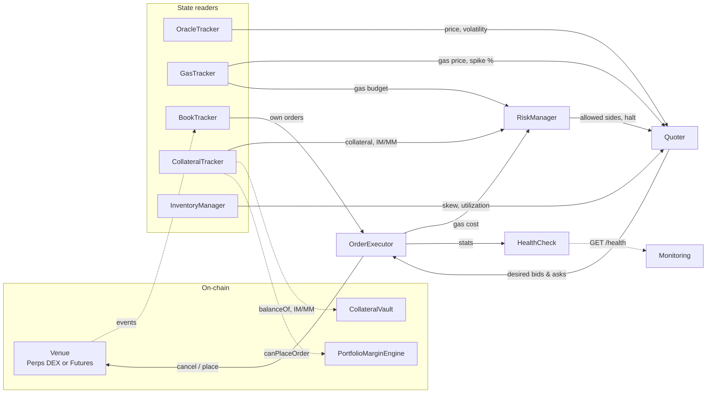

# Market Maker

Automated market maker for the Titan derivatives stack. Provides two-sided
liquidity on the **HashPowerPerpsDEX** (perps) and **Futures** (dated)
order books by placing layered limit quotes around the oracle price and
dynamically adjusting them based on inventory, volatility, and gas
conditions.

The same codebase ships two independent processes — one per venue — each
with its own wallet, configuration, and health port. Both share a
`core/` library for pricing, sizing, risk, execution, and health
reporting; venue-specific logic lives behind a thin `InstrumentAdapter`
interface in `src/adapters/{perps,futures}/`.

## Architecture

A single poll loop (`tick`) reads on-chain state, computes desired
quotes, and reconciles them against resting orders.



### Components

| Component | File | Role |
|---|---|---|
| **OracleTracker** | `core/oracleTracker.ts` | Reads the venue's raw oracle price each tick; tracks rolling volatility |
| **GasTracker** | `core/gasTracker.ts` | Reads gas price, detects spikes, estimates tx costs in USD via ETH price feed |
| **BookTracker** | `core/bookTracker.ts` | Maintains a local mirror of the venue's book + own orders via venue-supplied snapshots and event subscriptions |
| **CollateralTracker** | `core/collateralTracker.ts` | Reads vault balance, portfolio IM/MM from `PortfolioMarginEngine`, manages auto-deposits |
| **InventoryManager** | `core/inventoryManager.ts` | Tracks net position from venue-reported state |
| **RiskManager** | `core/riskManager.ts` | Drawdown circuit breaker, daily loss limit, gas budget throttling, position limit enforcement, engine `canPlaceOrder` checks |
| **Quoter** | `core/quoter.ts` | Computes bid/ask levels: Avellaneda-Stoikov inspired spreads with gas floor, volatility scaling, inventory skew |
| **OrderExecutor** | `core/orderExecutor.ts` | Diffs desired quotes vs resting orders; cancels stale, places new; gas-capped transactions |
| **HealthCheck** | `core/healthcheck.ts` | HTTP `/health` endpoint exposing live operational metrics |
| **Adapters** | `adapters/{perps,futures}/` | Venue-specific encoding/decoding, oracle access, snapshot fetching |

### Tick cycle

1. **Update** oracle price, gas price, order book, inventory, collateral
2. **Risk check** — halt if collateral below minimum or daily loss
   exceeded; throttle if gas budget exceeded
3. **Compute quotes** — N levels per side, spread = max(minSpreadBps,
   gasFloor) + volatility + inventory skew + gas penalty
4. **Reconcile** — selective requoting: only cancel/place orders that
   changed; skips requote if price drift is below threshold or cooldown
   hasn't elapsed; skips non-urgent requotes during gas spikes

### Quoting strategy

- **Base spread**: configurable minimum in basis points (`minSpreadBps`)
- **Gas floor**: minimum spread to break even on round-trip gas costs
  (cancel + place)
- **Volatility component**: `volatilityMultiplier · rollingVolatility · 10000` bps
- **Inventory skew**: shifts both bid and ask toward reducing exposure;
  controlled by `inventorySkewGamma` and `maxSkewTicks`
- **Gas spike penalty**: widens spread proportionally when gas exceeds
  median by `gasSpikeThresholdPct`
- **Level sizing**: geometric taper — outer levels are progressively
  larger by `levelSizeRatio`

### Risk controls

- **Position limits**: max net position size; blocks the side that
  would increase exposure
- **Utilization cap**: when `requiredMargin / collateral` exceeds
  `maxUtilizationPct`, only quotes the reducing side
- **Drawdown halt**: stops quoting and cancels all orders if
  collateral drops below `minCollateralBalance`
- **Daily loss halt**: includes gas costs in PnL calculation; halts if
  daily loss exceeds `maxDailyLossUsd`
- **Gas budget throttle**: rolling hourly/daily gas budgets; when
  exceeded, requote cooldown and threshold tighten
- **Gas spike deferral**: during gas spikes, requotes are deferred
  unless price drift exceeds `urgentRequoteThresholdTicks`
- **Gas cap**: `maxFeePerGas` is capped at `gasCapMultiplier · medianGasPrice`
- **Engine pre-check**: each placement is gated by
  `PortfolioMarginEngine.canPlaceOrder(additionalIM)` so we never
  submit orders the vault can't margin

### Matching modes

- **Perps** (`limit`): contract matches at any price strictly better
  than the resting limit. Outdated own orders that are still better
  than the new desired price are kept in place.
- **Futures** (`exact`): contract matches at the exact resting price.
  Any deviation in either direction means the order has to be
  cancelled and re-placed.

The shared `OrderExecutor` branches on the adapter's `matchingMode`
when deciding whether an existing order is still good.

### Graceful shutdown

On `SIGINT` / `SIGTERM` the process stops the tick loop and (by
default) cancels all resting orders before exiting. Set
`cancelOrdersOnShutdown: false` in the config to leave resting orders
on the book for hot restarts.

## Configuration

Each app ships per-environment YAML configs under `configs/`:

| File | Network |
|---|---|
| `perps.local.yml`   / `futures.local.yml`   | hardhat |
| `perps.dev.yml`     / `futures.dev.yml`     | base-sepolia |
| `perps.stg.yml`     / `futures.stg.yml`     | base-mainnet |
| `perps.prd.yml`     / `futures.prd.yml`     | base-mainnet |

Pick one with `--config <path>` (CLI flag), `MAKER_CONFIG=<path>` (env
variable), or `MAKER_ENV=<local|dev|stg|prd>` inside the docker
entrypoint. Precedence is `--config` > `MAKER_CONFIG` > docker
`MAKER_ENV` lookup.

The YAMLs are validated against generated JSON Schemas (autocomplete
and type-checking work in any editor with the YAML extension). They
interpolate `${VAR}` tokens from environment variables. On startup
both apps load `.env` from `market-maker/` and from the parent
`collateral-margin/` (in that priority order); live `process.env`
always wins over file contents.

```bash
pnpm local:perps      # node … --config configs/perps.local.yml | pino-pretty
pnpm dev:futures      # node … --config configs/futures.dev.yml  | pino-pretty
pnpm stg:perps        # node … --config configs/perps.stg.yml
pnpm prd:futures      # node … --config configs/futures.prd.yml

# One-off / custom path:
node src/apps/perps/main.ts --config /tmp/my-perps.yml
```

All operational tuning (sizes, spreads, risk caps, gas budgets,
timings, log level) lives in the YAML files. Refer to those for the
authoritative list of fields.

### Required environment variables

These must be set in `.env` (or the live environment); everything
else lives in YAML.

| Variable | Required by | Description |
|---|---|---|
| `PRIVATE_KEY` | all | Hex-encoded private key for the MM wallet |
| `ALCHEMY_API_KEY` | dev / stg / prd | Used by the bundled YAMLs to compose the RPC URL |
| `PERPS_ADDRESS` | perps app | Deployed `HashPowerPerpsDEX` proxy address |
| `FUTURES_ADDRESS` | futures app | Deployed `Futures` proxy address |

Custom YAMLs may reference additional `${VAR}` tokens (e.g. a
non-Alchemy RPC URL, a chain id override). The bundled YAMLs in
`configs/` only reference the four above plus the RPC URL.

## Getting started

### Prerequisites

- Node.js ≥ 22.6.0
- pnpm ≥ 10

ABIs are pulled directly from the upstream contract repos as Git
dependencies (`futures-contracts`, `perps-contracts`,
`collateral-margin-contracts`). No manual sync is required — `pnpm
install` is enough.

### Install

```bash
cd market-maker
pnpm install
```

### Run

```bash
# Local hardhat (pretty-printed logs, dry-run on by default)
pnpm local:perps
pnpm local:futures

# base-sepolia (dev testnet)
pnpm dev:perps
pnpm dev:futures

# base-mainnet (staging — pre-prod sizes)
pnpm stg:perps
pnpm stg:futures

# base-mainnet (production)
pnpm prd:perps
pnpm prd:futures
```

## Health endpoint

`GET http://localhost:{healthPort}/health` returns a JSON snapshot of
live operational state — status, halt/throttle reasons, oracle and
gas readings, position and collateral, order counts, and uptime.
Suitable for liveness/readiness probes and for scraping into a
dashboard. The exact field set is exercised by
`tests/core/healthcheck.test.ts`.

## Testing

```bash
pnpm test
```

The suite uses Node's built-in test runner (`node --test`) with
TypeScript strip mode — no transpile step. Tests run unit-only
against in-memory mocks of the adapters; venue end-to-end checks live
in the upstream contract repos.
